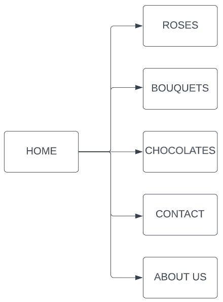

# CHRISTIAN KALKI M. LAMADRID | MINI-PROJECT 1

## Background Of The project

This is a flower store website called Tita's Flower Shop. The main page directs you to other pages whether you want to shop for roses, bouquets, or chocolates.

## Sitemap

## Wireframe LFD Link:

https://www.figma.com/file/IIvSpsNwBHFdOGmuviU9wN/FlowerHomePage?node-id=0%3A1&t=T8YuA00p1UaaxTdt-0

## Wireframe HFD Link:

https://www.figma.com/file/IIvSpsNwBHFdOGmuviU9wN/FlowerHomePage?node-id=0%3A1&t=T8YuA00p1UaaxTdt-0

## Github Page Link:

https://mujugen.github.io/Mini-Project1/index.html

## Two weeks prior of the mini-project

## Project Goals / Services provided by the application

1. Responsive webpage
2. Clean code
3. Mobile friendly
4. Modular webpage using js
5. Hosted on GitHub Pages

## TECHNOLOGIES

1. HTML , CSS, and Javascript
2. Bootstrap
3. Jquery

## CONTRIBUTORS:

1. CHRISTIAN KALKI M. LAMADRID

## CURRENT FEATURES IMPLEMENTED

1. Responsive webpage
2. Clean code
3. Mobile friendly
4. Modular webpage using js
5. Hosted on GitHub Pages

## ADDITIONAL POST-RELEASE FEATURES (OPTIONAL)

1. Store backend
2. Store items with ID
3. Store search feature
4. User accounts
5. Store checkout
